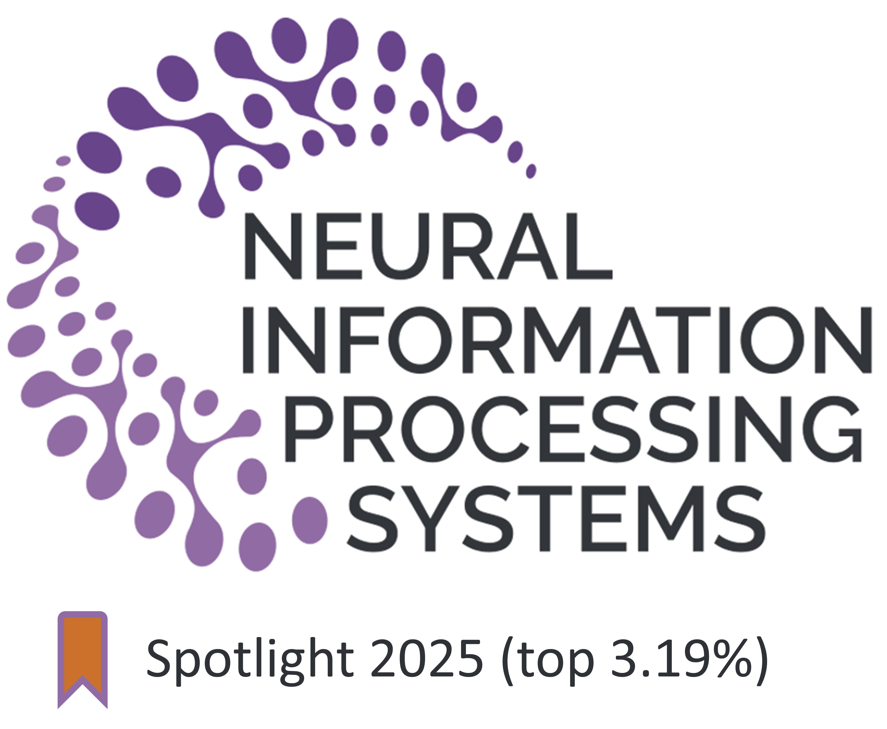
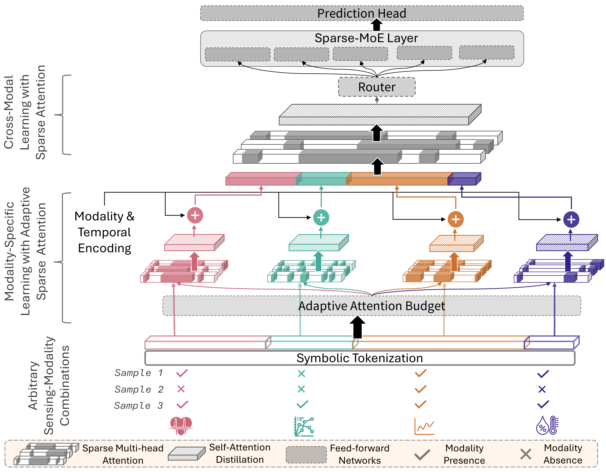

<!-- Header with ACL logo and title -->
<div style="max-width: 960px; margin: auto; padding-top: 20px; 
            display: flex; align-items: center; white-space: nowrap;">
  
  <h1 style="margin: 0; font-size: 1.8em; overflow: hidden; text-overflow: ellipsis;">
    MAESTRO : Adaptive Sparse Attention and Robust Learning for Multimodal Dynamic Time Series
  </h1>
</div>


<!-- Overview and system diagram side-by-side -->
This repository contains the MAESTRO codebase: models, preprocessed data and training for learning robust learning from multimodal and heterogeneous time series.

## Overview

1. Time series from different sensors are often treated as multivariate time series simply because they share a common data structure. MAESTRO instead advocates for explicitly multimodal handling of such data.

2. Standard multimodal approaches typically assume high mutual information across modalities, which may not hold for heterogeneous sensors. Such sensors can instead reveal emergent or complementary properties.

3. Pairwise modeling of modalities does not scale beyond 3–4 inputs, making it unsuitable for multi-sensor applications with 10+ modalities.

### What MAESTRO Does

* Constructs long multimodal sequences and applies sparse attention to mitigate the quadratic space complexity of standard attention.

* Uses a sparse Mixture-of-Experts (MoE) layer for efficient computation.

* Applies symbolic tokenization with a reserved token for missing modalities, making the model natively robust to arbitrary missingness.





## Gettting Started
### 1. Installation
To recreate the exact Conda environment, run:  
```bash
conda env create -f environment.yml -n maestro
conda activate maestro
```

### 2. Data access
- WESAD
   - Original : https://archive.ics.uci.edu/ml/datasets/WESAD+%28Wearable+Stress+and+Affect+Detection%29 

- DSADS
   - Original: https://archive.ics.uci.edu/dataset/256/daily+and+sports+activities
   - Note: preprocessing follows the approach used in the Microsoft RobustLearn repo (see code link in original README).

-  DaliaHAR
   - Original: https://archive.ics.uci.edu/dataset/495/ppg+dalia
   - Raw preprocessing scripts: `data_utils/dalia_preprocess/`

Processed versions used in this repository (shared): https://zenodo.org/records/17227234

- MIMIC (restricted access)
   - Follow the official MIMIC access procedure: https://mimic.mit.edu/iv/access/
   - After obtaining access, contact the dataset maintainer of [Multibench](https://github.com/pliang279/MultiBench) (see original README) with proof to obtain the preprocessed `im.pk` file used by the experiments.


### 3. Running Main Experiments

#### 3.1 Update Data Paths

After downloading the datasets, update the paths in each main experiment file. Search for `UPDATE_PATH` in each `main_*.py` file and replace with your local paths.

#### 3.2 Reproduce Table 2 Results

Run the following commands to train the model and reproduce the results in Table 2 of the paper:
```bash
python main_wesad_maestro.py
python main_dsads_maestro.py
python main_mimic_maestro.py
python main_daliahar_maestro.py
```


#### 3.3 Additional arguments :

To run without SAX :
```bash
python main_wesad_maestro.py --transform='None'
```

To evaluate with dropped out modalities 
```bash
python main_wesad_maestro.py --modality_drop=0.2 % change till 0.4 for Figure 5 of the paper.
```

## Project layout
- `data_utils/` — dataset-specific preprocessing and dataloader helpers
- `models/` — model definitions, attention modules, and training utilities
- `utils/` — data and training related configurations
- Creates 
   - `results_dir/` - json with the performance metrics
   - `saved_chk_dir` - best checkpoint saved


## Reproducibility notes

If you use this code, please cite the paper:

Preprint: https://arxiv.org/abs/2509.25278

Suggested citation:

```
@inproceedings{maestro2025,
   title={MAESTRO: Adaptive Sparse Attention and Robust Learning for Multimodal Dynamic Time Series},
   author={Payal Mohapatra, Yueyuan Sui, Akash Pandey, Stephen Xia, Qi Zhu},
   booktitle={NeurIPS},
   year={2025}
}
```

##  Future Support

Currently, all data are resampled to a `base_sampling_rate` configurable in `./utils/dataset_cfg.py`.

Future versions will support variable sampling rates.


## Acknowledgment 
We are thankful to the following contributors for opensourcing their code :
1. AdaTime : https://github.com/emadeldeen24/AdaTime
2. Informer : https://github.com/zhouhaoyi/Informer2020
